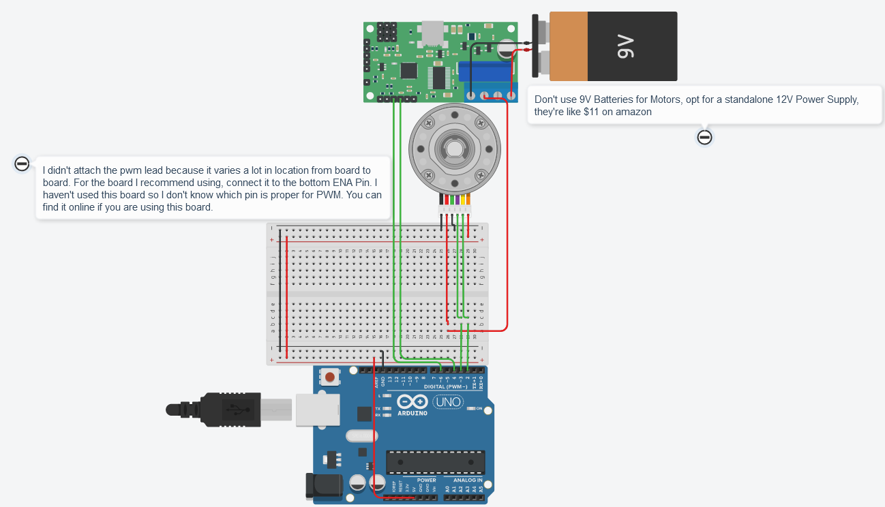

# Arduino PID Demo

## What is PID?

PID Control, or Proportional Integral Derivative Control, is a control system used in machines. You can read up more on PID if you want to know how it works, and if you're on FRC Team 3624 you can read our docs.

## How to use

This was created for a simple PID Motor demo utilizing a single motor and a few parts. All the parts combined (assuming you already have an arduino and some wires + basic stuff) should be under $20. The code should work for most motors with an encoder, but the CAD file is specialized for my use. If you would like to use this exact demo, you can buy [this motor](https://www.amazon.com/dp/B07GNGCNK1?psc=1&ref=ppx_yo2_dt_b_product_details) and any cheap motor driver chip, althought I'd recommend [this](https://www.amazon.com/dp/B07WS89781?psc=1&ref=ppx_yo2_dt_b_product_details)

To run the code just download the file and run it using the Arduino IDE. To simplify this for beginners, I'll attach a TinkerCAD diagram for the circuits:

I'm using this mostly to test out some auto PID tuning stuff I've been playing with. Probably won't see a lot of updates and stuff.
